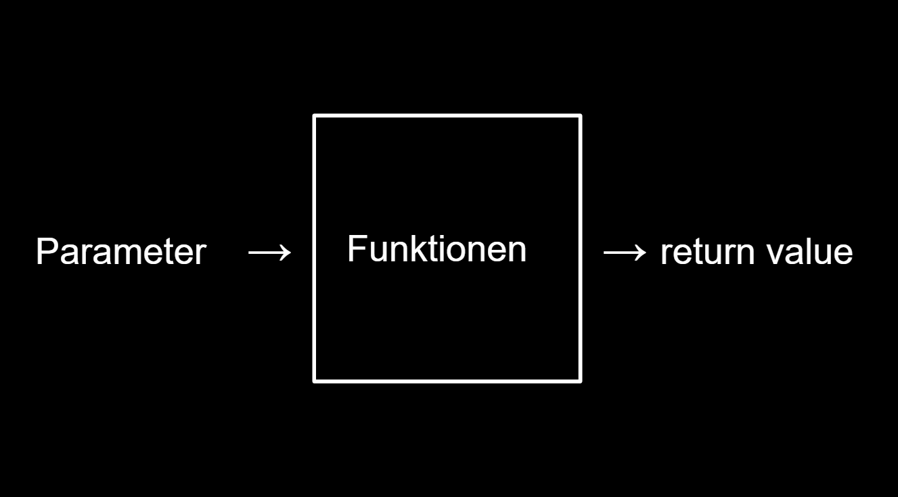
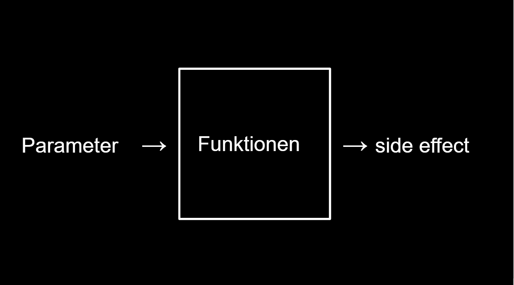

# Funktionen 




---
## Return Values
`Return Values` klingt etwas kompliziert ist es aber nicht. Es heißt eigentlich nur, dass eine Funktion einen Wert nach Operationen ausgibt.

```python
def adder(a, b):
    """
    Addiert zwei zahlen und gibt die Summe wieder
    """
    return a + b
print(adder(a, b))
# Die Funktion wird die Summe aus 4 und 5 ausgeben und das ist dann der Parameter der print() Funktion.

# Die Paremeter können natürlich auch Variablen sein.

```

```python
a = 10
b = 40
adder(a, b)
print(f"a = {a}, b = {b})
    >>> a = 10, b = 40
```
*Die Variablen a und b bleiben unverämdert, da ja nur die Parameter verändert werden und nichtdie Variablen a und b*

---
Funktionen können auch andere Funktionen als input haben. Diese müssen dazu etwas returnen.

---

Parameter können auch einen default Wert haben, der wenn der Parameter nicht bei dem call definiert wird, von Python einfach eingesetzt werden.

Man kann auch einen Parameter beim Call definieren.

```python
def add (a=1, b=2):
    return a + b

print(add())
    >>> 3
print(add(b = 6))
    >>> 7
print(add(4))  
    >>> 6    
```
---
## Side effects

Bei *Side effects* handelt es sich lediglich um Funktionen, die die Instanz verändern können. Das ist einfach nur eine Funktion, die Effekte außerhalb ihrer Operationen hat und so auf andere Variablen zugreift etc.

```python
x = 10
print(x)
    >>> 10
def setX(n):
    global x
    x = n
setX(60)
print(x)
    >>> 60
```
Das keyword `global` ermöglicht der Funktion  die Varible/n nach dem `global` zu verändern

---
